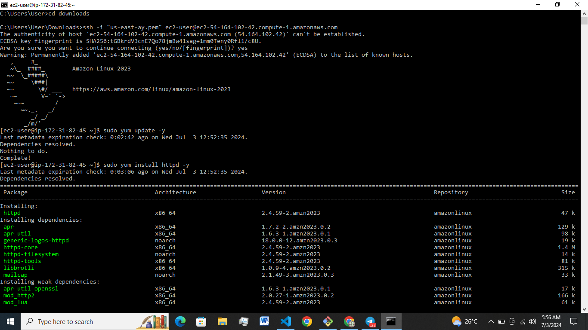

# Deploying a Static Website on AWS Using Apache 




### Prerequisites:
- An AWS account.
- A key pair for SSH access to the EC2 instance.
- A Git repository containing your static website files.

### Step-by-Step Guide:

### 1. Launch an EC2 Instance

1. Log in to the AWS Management Console:
- Navigate to the EC2 Dashboard.
- Click "Launch Instance."

2. Choose an Amazon Machine Image (AMI):
- Select an Amazon Linux 2 AMI.

3. Select Instance Type:
- Choose an instance type (e.g., t2.micro for free tier eligibility).

4. Configure Instance Details:
- Configure as needed or use default settings.

5. Add Storage:
- Adjust storage settings if necessary.

6. Configure Security Groups:
- Add rules to allow HTTP (port 80) and SSH (port 22) access.

7. Review and Launch:
- Review the instance configuration.
- Launch the instance and select your key pair.

### 2. Connect to the EC2 Instance

1. SSH into Your Instance:
- Use the following command to connect to your instance (replace the path to your key pair and the instance public DNS):
   
```sh
   ssh -i /path/to/your-key-pair.pem ec2-user@your-instance-public-dns
```
         
     
### 3. Install and Configure Apache 

#### For Apache:

1. Install Apache:
```sh
sudo yum update -y
sudo yum install httpd -y
```    


2. Start and Enable Apache:
```sh
   sudo systemctl start httpd
   sudo systemctl enable httpd
```
     
   
### 4. Install Git and Clone Your Repository

 Install Git:
```sh
     sudo yum install git -y
```
Clone Your Git Repository:
```sh
     cd /tmp
   git clone https://github.com/Aymogul/HNG-task-0-static-website-deployment.git
```
### 5. Deploy Your Static Website

#### For Apache:

1. Copy Website Files to Document Root:
```sh
     sudo cp -r /tmp/your-repository/* /var/www/html/
```
   
### 6. Configure Security Groups

1. Ensure Security Group Rules Allow HTTP Traffic:
   - Verify that your security group rules allow HTTP traffic on port 80.

### 7. Access Your Website

1. Open a Web Browser:
   - Enter the public DNS or IP address of your EC2 instance to view your static website.


